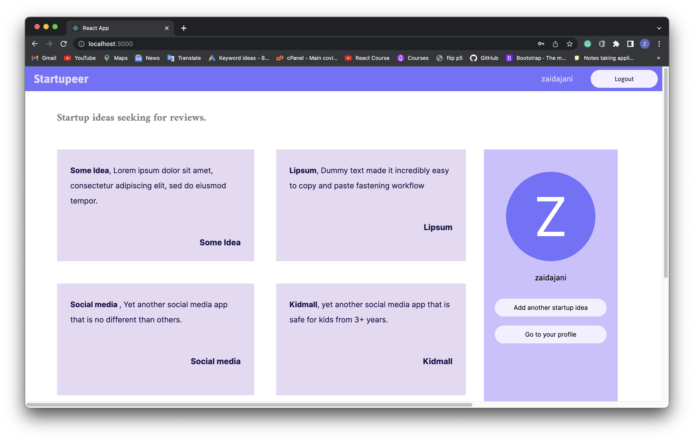
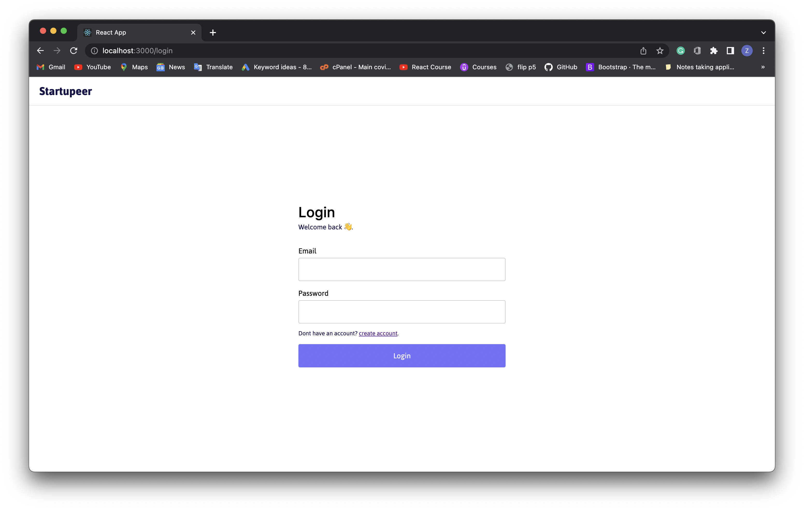
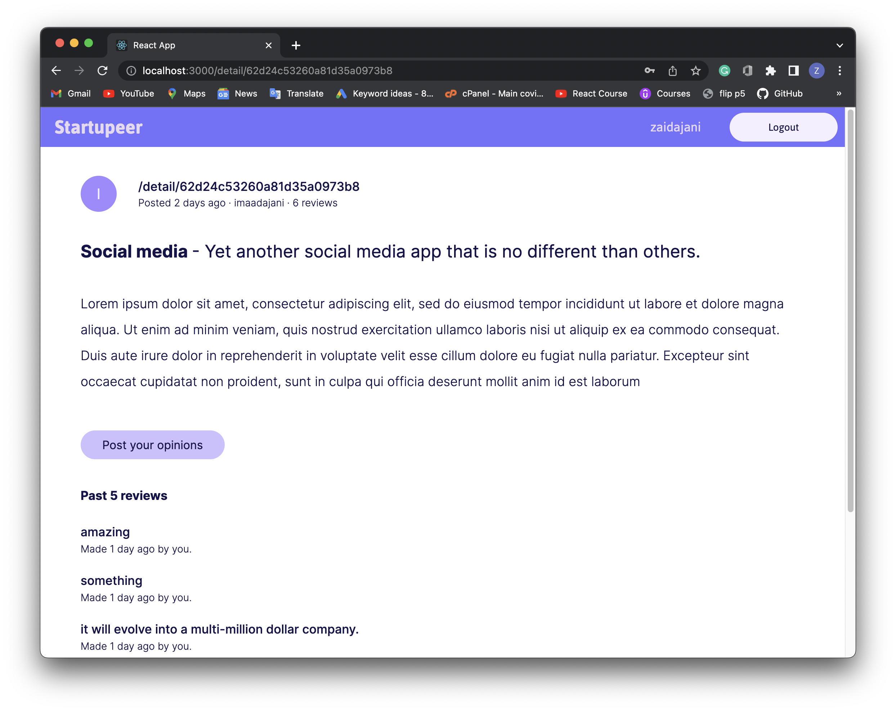
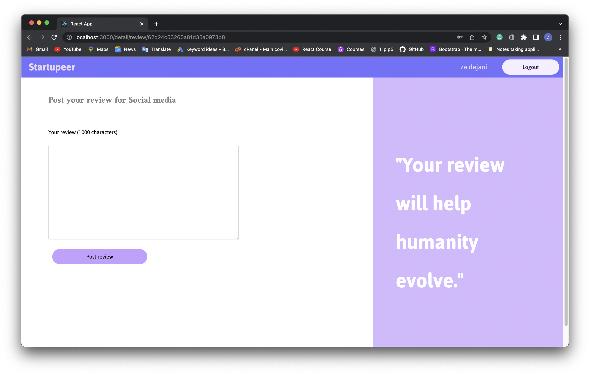
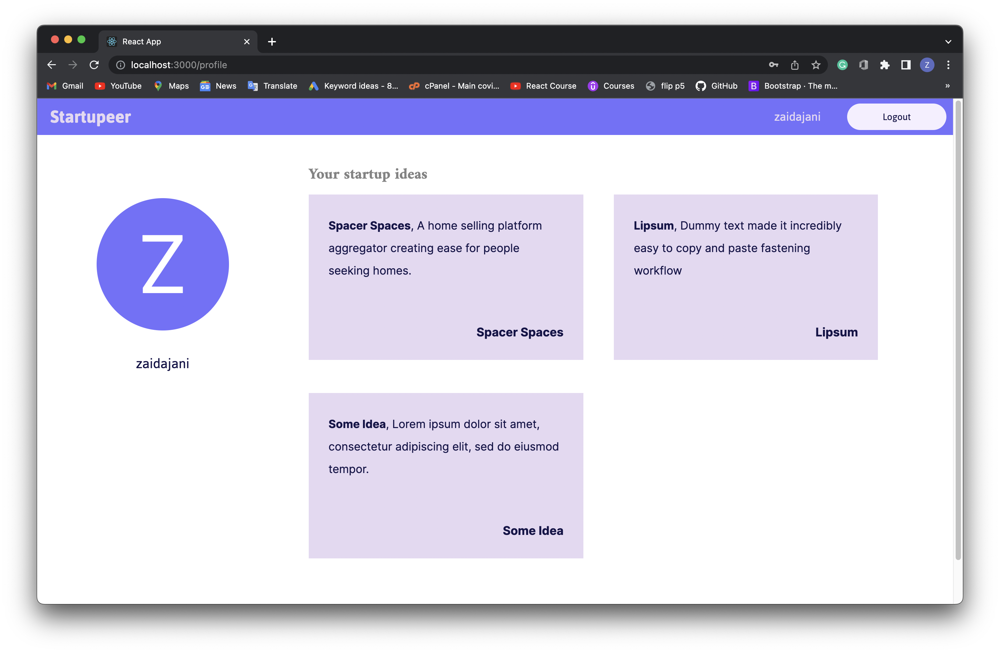

# Startupeer

[](https://github.com/tterb/atomic-design-ui/blob/master/LICENSEs)


### A utility where startup ideas meet market reviews about it. Open source and reliable.

---

## Parts


It consists of 6 pages with dynamic content based on the authentication.

---

### Home Page



### Login and Register pages



### Startup detail page



### New startup page


### Startup review page



### Profile page



## Run Locally

Clone the project

```bash
  git clone https://github.com/zaidajani/startupeer.git
```

Go to the project directory

```bash
  cd startupeer
```

Install dependencies

```bash
  cd server
  npm i
```

Start the server

```bash
  npm run dev
```

Open a new terminal and install react dependencies.

```bash
  npm i
```

Run react app

```bash
  npm run start
```

## Tech Stack

**Client:** React

**Server:** Node, Express

**Databse:** MongoDb

## More about server

* Node
* Express
* Mongoose
* JWT
* Bcrypt

Pretty simple yet effective server.


## Author profiles
[](https://www.linkedin.com/in/zaid-ajani-67169b204/)
[](https://youtube.com/zaidajani)
[](https://github.com/zaidajani)

## Contributors

* <a href="http://github.com/zaidajani">zaidajani</a>
